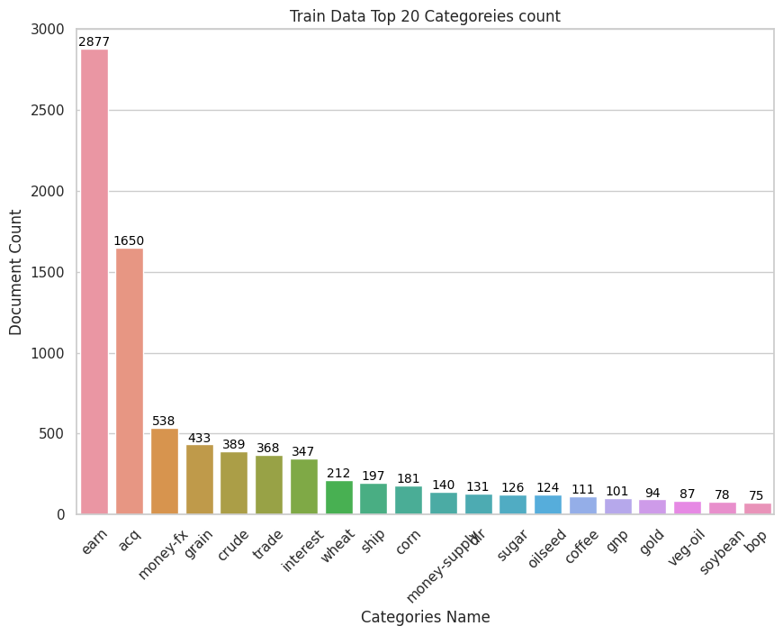
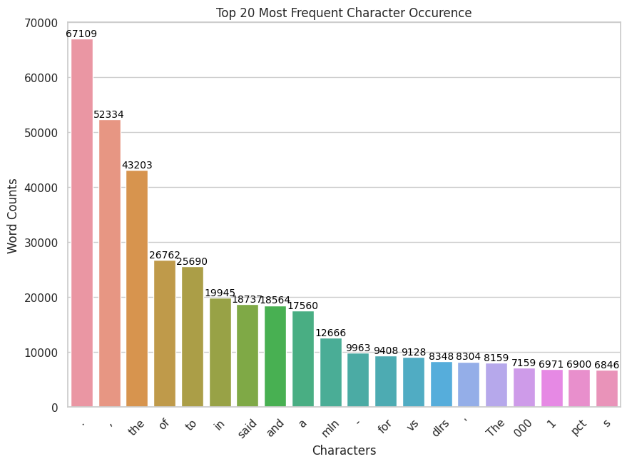

# News Article Classification

## Overview

This project aims to classify news articles using the Reuters dataset from NLTK. Various machine learning models, including traditional algorithms and deep learning, have been employed for the task. The project utilizes TF-IDF (Term Frequency-Inverse Document Frequency) for feature extraction and MultiLabelBinarizer for handling multiple labels.

## Dataset

The dataset used in this project is the Reuters dataset from NLTK, which is a collection of news documents with associated categories. The dataset is preprocessed to suit the classification task.

## Models

The following machine learning models have been implemented and evaluated:

- Logistic Regression
- Linear Support Vector Classification (LinearSVC)
- k-Nearest Neighbors (KNN)
- Decision Tree
- Random Forest
- Gaussian Naive Bayes

In addition to traditional models, a deep learning model has been employed for enhanced performance.

## Exploratory Data Analysis

Check more EDA Process in the [notebook](main_ipynb)

## Results

## Acknowledgment

## Acknowledgments

- NLTK for providing the Reuters dataset.
- Scikit-learn and TensorFlow for machine learning and deep learning frameworks.
- Special thanks to [Martin Thoma](https://martin-thoma.com/nlp-reuters/) for valuable insights and resources on NLP with the Reuters dataset.

